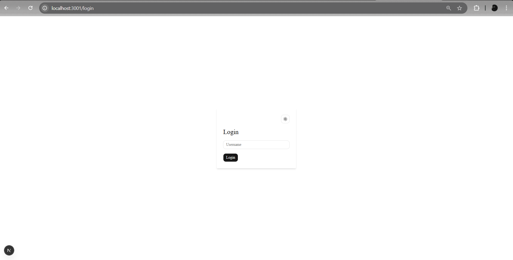
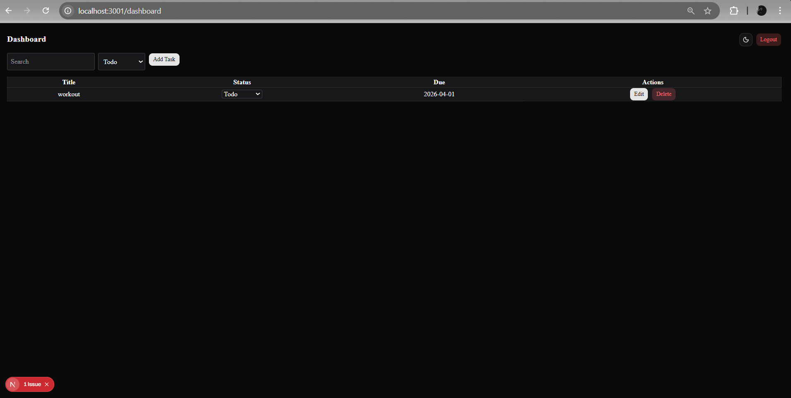
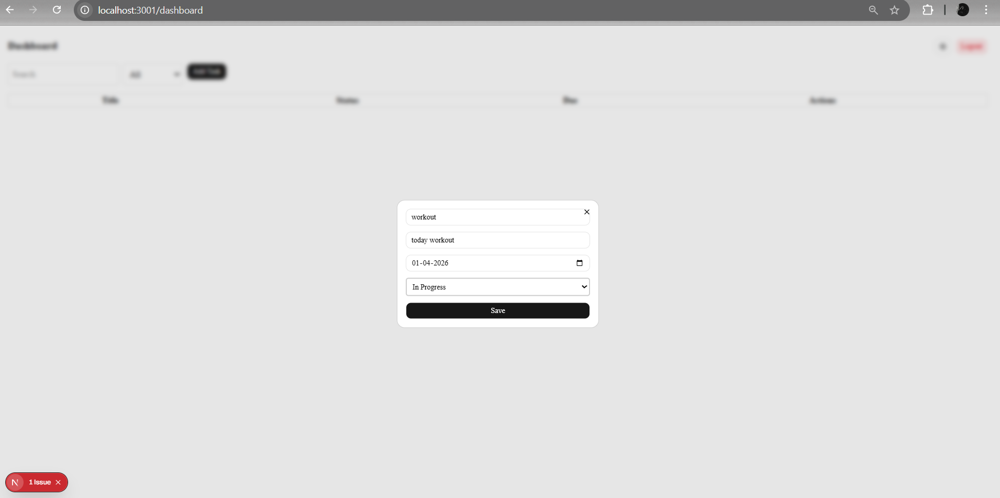
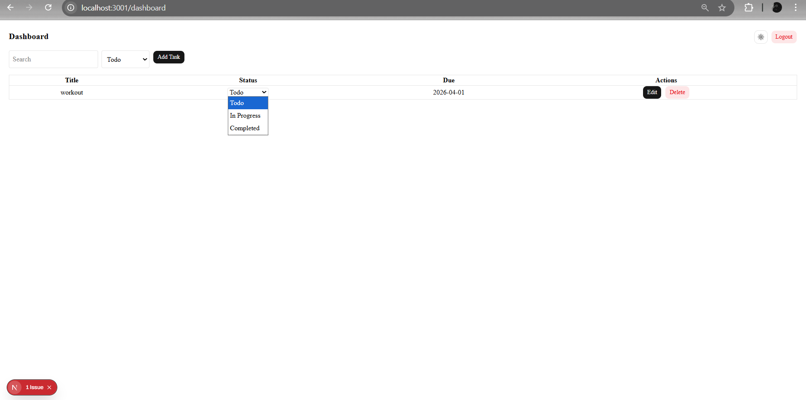
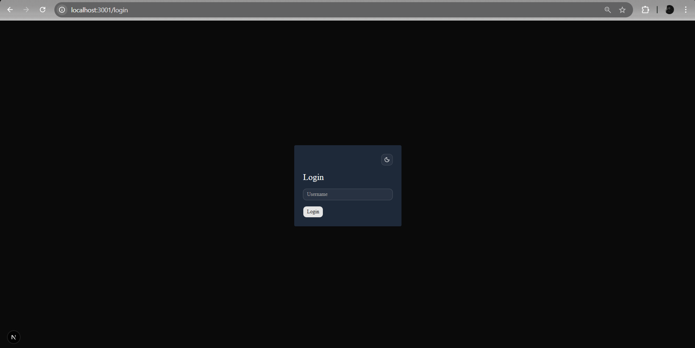

#  Task Management Dashboard

A simple and responsive Task Management application built using modern frontend technologies. This project was developed as part of an internship assignment.

---

##  Tech Stack

- Next.js (App Router)
- TypeScript
- Tailwind CSS
- shadcn/ui

---

##  Features

###  Authentication (Mock)
- Simple login page
- Stores user session using localStorage
- Redirects to dashboard after login

---

###  Dashboard
- Displays tasks in a structured layout
- Each task includes:
  - Title
  - Description
  - Status (Todo / In Progress / Completed)
  - Due Date

---

###  CRUD Operations
-  Create Task (Modal using shadcn Dialog)
-  Edit Task
-  Delete Task
-  Update Task Status (Dropdown)

---

###  Filtering & Sorting
-  Search tasks by title
-  Filter tasks by status
-  Sort tasks by due date

---

###  UI & UX
- Built using shadcn/ui components
- Clean and responsive design
- Reusable components
- Proper TypeScript typing (no `any`)

---

###  Bonus Features
-  Dark Mode support
- Smooth UI interactions

---

##  Screenshots

### Login Page


### Dashboard


### Add Task


### Add Task


### Add Task


---

##  Setup Instructions

1. Clone the repository:
```bash
git clone https://github.com/jerrin0256/task-manager.git